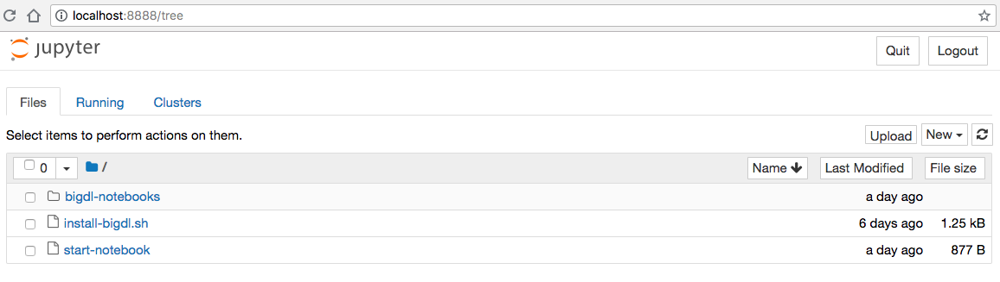
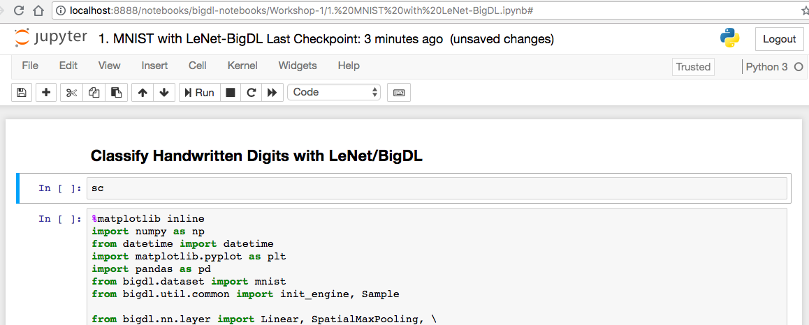

In this post I will walk you through the steps to set up a working environment for the hands-on part of my workhop on Image Recognition with Spark/BigDL. If you want to jump to the workshop part right away, you can download a pre-built docker image from [https://hub.docker.com/r/kalininalex/lenet-bigdl/](https://hub.docker.com/r/kalininalex/lenet-bigdl/).

We'll now create a docker image from scratch. First, we need to choose a base image, such as Ubuntu Linux distribution. Let's download such image first:

```bash
	docker pull ubuntu:latest
```

After the command finishes, you can list all the images on your machine:

```bash
	$ docker images
	REPOSITORY          TAG                 IMAGE ID            CREATED             SIZE
	ubuntu              latest              452a96d81c30        5 weeks ago         79.6MB
```

We can launch the image and log into it:

```bash
	docker run -p 8888:8888 --hostname localhost -it ubuntu:latest /bin/bash
```

You will see a command line prompt:

```bash
	root@localhost:/#
```

You are in a bash session inside the virtual machine running the Ubuntu image. Let's install libraries and packages.

### 1. Install Anaconda

We'll use Anaconda package manager for Python to get all the packages for our Jupyter notebook.

```bash
	 cd ~
	 apt-get update --fix-missing 
	 apt-get install -y wget bzip2 ca-certificates libglib2.0-0 libxext6 libsm6 libxrender1 git mercurial subversion vim unzip
```

Install a minimal version of Anaconda called Miniconda. Further, I will use Anaconda and Miniconda terms interchangeably.
```bash
	wget https://repo.continuum.io/miniconda/Miniconda2-4.4.10-Linux-x86_64.sh -O ~/miniconda.sh 
	/bin/bash ~/miniconda.sh -b -p /opt/conda
    rm ~/miniconda.sh
    ln -s /opt/conda/etc/profile.d/conda.sh /etc/profile.d/conda.sh
    echo ". /opt/conda/etc/profile.d/conda.sh" >> ~/.bashrc
    echo "conda activate base" >> ~/.bashrc
```

Reload the session variables to activate Anaconda:
```bash
	cd ~
	source ~/.bashrc
```

Create a new conda environment:
```bash
	conda create -y -n py35 python=3.5
```

Activate the newly created environment:
```bash
	source activate py35
```

Install Python packages, including Jupyter:
```bash
	conda install -y numpy
	conda install -y pandas
	conda install -y jupyter
	conda install -y matplotlib
```

Install MNIST dataset for python. We'll use it in the demo:

```bash
	pip install python-mnist
```

## 2. Install Spark and BigDL

We'll use our Anaconda package manager to install Java with a couple of simple commands:


```bash
	apt-get -y install apt-utils
	conda install -y -c reeder java-jdk
```

Confirm that you have Java 1.8:

```bash
	java -version
```

The output should look something like:
```bash
	openjdk version "1.8.0_92"
	OpenJDK Runtime Environment (Zulu 8.15.0.1-linux64) (build 1.8.0_92-b15)
	OpenJDK 64-Bit Server VM (Zulu 8.15.0.1-linux64) (build 25.92-b15, mixed mode)
```

## 3. Install Spark and BigDL

Install Spark 2.2:

```bash
	export SPARK_NAME=spark-2.2.0-bin-hadoop2.7
	wget https://d3kbcqa49mib13.cloudfront.net/${SPARK_NAME}.tgz
	tar xzf ${SPARK_NAME}.tgz
	rm ${SPARK_NAME}.tgz
```

Install BigDL 0.3:

```bash
	export BIGDL_VER=0.3.0
	export BIGDL_NAME=dist-spark-2.2.0-scala-2.11.8-linux64-${BIGDL_VER}-dist
	wget https://repo1.maven.org/maven2/com/intel/analytics/bigdl/dist-spark-2.2.0-scala-2.11.8-linux64/${BIGDL_VER}/${BIGDL_NAME}.zip
```

Unpack BigDL:

```bash
	mkdir ${BIGDL_NAME}
	mv *.zip ${BIGDL_NAME}
	cd ${BIGDL_NAME}
	unzip *.zip
	rm *.zip
	cd ..
```


## 3. Create a startup script

Create a new file in Vi editor:

```bash
	vi 	~/start-notebook
```

Paste the following code and save:
```bash
	#!/bin/bash
	export SPARK_HOME=~/spark-2.2.0-bin-hadoop2.7
	export BigDL_HOME=~/dist-spark-2.2.0-scala-2.11.8-linux64-0.3.0-dist

	MY_PATH="`dirname \"$0\"`"

	export PYSPARK_DRIVER_PYTHON=jupyter
	export PYSPARK_DRIVER_PYTHON_OPTS="notebook --allow-root --notebook-dir=./ --ip=* --no-browser "
	VERSION=0.3.0

	source activate py35

	if [ -z "$CORES" ]; then
		CORES=2
	fi

	${SPARK_HOME}/bin/pyspark \
	  --master local[$CORES] \
	  --driver-memory 5g \
	  --properties-file ${BigDL_HOME}/conf/spark-bigdl.conf \
	  --py-files ${BigDL_HOME}/lib/bigdl-${VERSION}-python-api.zip \
	  --jars ${BigDL_HOME}/lib/bigdl-SPARK_2.2-${VERSION}-jar-with-dependencies.jar \
	  --conf spark.driver.extraClassPath=${BigDL_HOME}/lib/bigdl-SPARK_2.2-${VERSION}-jar-with-dependencies.jar \
	  --conf spark.executor.extraClassPath=${BigDL_HOME}/lib/bigdl-SPARK_2.2-${VERSION}-jar-with-dependencies.jar
```
 ## 4. Download the notebook files

 ```bash
 cd ~
 git clone https://github.com/alex-kalinin/lenet-bigdl.git
 ```

## 5. Run Jupyter

Now we can run the notebook:

```bash
bash start-notebook
```

The Jupyter will print a URL that you can use to connect to the notebook. The output will look something like:
```bash
[I 18:19:48.486 NotebookApp] Writing notebook server cookie secret to /root/.local/share/jupyter/runtime/notebook_cookie_secret
[I 18:19:48.699 NotebookApp] Serving notebooks from local directory: /~
[I 18:19:48.699 NotebookApp] 0 active kernels
[I 18:19:48.700 NotebookApp] The Jupyter Notebook is running at:
[I 18:19:48.700 NotebookApp] http://localhost:8888/?token=9a8f40ef87efe44988ba09a31078e3b732f5475371a689e2
[I 18:19:48.700 NotebookApp] Use Control-C to stop this server and shut down all kernels (twice to skip confirmation).
```

Switch to you host computer, open a browser and connect to this URL. You should see the Jupyter notebook: 



Go to **`bigdl-notebooks/Workshop-1`** directory and click on the **`1. MNIST with LeNet-BigDL.ipynb`** file. It will open the notebook:



The first cell will print the contents of the object **`sc`**. This object of type `SparkContext` is automatically created by Spark. Go ahead and run the first cell. If it prints the information about the `sc` object then your setup worked as expected and you can run the rest of the notebook. However, if it prints `NULL` or an empty string `''`, then something went wrong and you might want to re-trace your steps.


# Make It Permanent

The only issue with this setup is if you exit the docker container and restart it, all changes will be lost. We will have to repeat the setup process again. This is not good. Fortunately, there's a way to create a permanent docker image. To do this, create a new folder on your **host** computer, and call it `docker-setup`:

```bash
cd ~
mkdir docker-setup
cd docker-setup
```

Create a file **`install-bigdl.sh`** and collect all the steps we've done. Paste the code below into `install-bigdl.sh` file:

```bash
#!/bin/bash	 

cd ~

wget https://repo.continuum.io/miniconda/Miniconda2-4.4.10-Linux-x86_64.sh -O ~/miniconda.sh 
/bin/bash ~/miniconda.sh -b -p /opt/conda
rm ~/miniconda.sh
ln -s /opt/conda/etc/profile.d/conda.sh /etc/profile.d/conda.sh
echo ". /opt/conda/etc/profile.d/conda.sh" >> ~/.bashrc
echo "conda activate base" >> ~/.bashrc

cd ~
source ~/.bashrc

conda create -y -n py35 python=3.5
source activate py35

conda install -y numpy
conda install -y pandas
conda install -y jupyter
conda install -y matplotlib
pip install python-mnist

apt-get -y install apt-utils
conda install -y -c reeder java-jdk

java -version

export SPARK_NAME=spark-2.2.0-bin-hadoop2.7
wget https://d3kbcqa49mib13.cloudfront.net/${SPARK_NAME}.tgz
tar xzf ${SPARK_NAME}.tgz
rm ${SPARK_NAME}.tgz

export BIGDL_VER=0.3.0
export BIGDL_NAME=dist-spark-2.2.0-scala-2.11.8-linux64-${BIGDL_VER}-dist
wget https://repo1.maven.org/maven2/com/intel/analytics/bigdl/dist-spark-2.2.0-scala-2.11.8-linux64/${BIGDL_VER}/${BIGDL_NAME}.zip

apt-get -y install unzip
apt-get -y install vim

mkdir ${BIGDL_NAME}
mv *.zip ${BIGDL_NAME}
cd ${BIGDL_NAME}
unzip *.zip
rm *.zip
cd ..
```

Create a file **`start-notebook`** and paste our startup code into it:

```bash
#!/bin/bash
export SPARK_HOME=~/spark-2.2.0-bin-hadoop2.7
export BigDL_HOME=~/dist-spark-2.2.0-scala-2.11.8-linux64-0.3.0-dist

MY_PATH="`dirname \"$0\"`"

export PYSPARK_DRIVER_PYTHON=jupyter
export PYSPARK_DRIVER_PYTHON_OPTS="notebook --allow-root --notebook-dir=./ --ip=0.0.0.0 --no-browser "
VERSION=0.3.0

source activate py35

if [ -z "$CORES" ]; then
	CORES=2
fi

${SPARK_HOME}/bin/pyspark \
  --master local[$CORES] \
  --driver-memory 5g \
  --properties-file ${BigDL_HOME}/conf/spark-bigdl.conf \
  --py-files ${BigDL_HOME}/lib/bigdl-${VERSION}-python-api.zip \
  --jars ${BigDL_HOME}/lib/bigdl-SPARK_2.2-${VERSION}-jar-with-dependencies.jar \
  --conf spark.driver.extraClassPath=${BigDL_HOME}/lib/bigdl-SPARK_2.2-${VERSION}-jar-with-dependencies.jar \
  --conf spark.executor.extraClassPath=${BigDL_HOME}/lib/bigdl-SPARK_2.2-${VERSION}-jar-with-dependencies.jar
```

Create a file called **`Dockerfile`**. Dockerfile allows automating docker set up. Add the folowing lines to the Docketfile. I will explain every line in a moment.

```docker
FROM ubuntu:latest
WORKDIR ~
RUN apt-get update --fix-missing 
RUN apt-get install -y wget bzip2 ca-certificates libglib2.0-0 libxext6 libsm6 libxrender1 git mercurial subversion vim unzip
COPY install-bigdl.sh ./
RUN bash -i install-bigdl.sh
COPY start-notebook ./
RUN git clone https://github.com/alex-kalinin/bigdl-notebooks.git
```

At this point, you should have three files in your **`docker-setup`** directory:
```bash
    Dockerfile
    install-bigdl.sh
    start-notebook
```

Dockerfile instructs the `docker build` command how build a new docker image. The first line 
```docker
FROM ubuntu:latest
```
tells the Docker to start with the base image `ubuntu` with the label `latest`. It's the same image we used in our manual setup. 

The second line,
```docker
WORKDIR ~
```

sets the working directory inside the docker container after launch. In this case it'll be `root`'s home directory, `/root`.

The third and fourth lines run the `apt-get` commands inside the docker to install basic utilities. Our base image is lightweight and it lacks many standard tools. These are the same commands we've run before:
```docker 
RUN apt-get update --fix-missing 
RUN apt-get install -y wget bzip2 ca-certificates libglib2.0-0 libxext6 libsm6 libxrender1 git mercurial subversion vim unzip
```

The fifth line copies the file from the **host** machine into the working directory inside the docker container:
```docker
COPY install-bigdl.sh ./
```

The sixth line runs the installation script we've just copied:
```docker
RUN bash -i install-bigdl.sh
```

The seventh line copies the startup script inside the container:
```docker
COPY start-notebook ./
```

Finally, the eight line runs the command that clones the GitHub repository with Jupyter notebooks inside docker. 

To buid a new docker image, let's run a command inside the **`docker-setup`** directory:
```bash
docker build -t bigdl .
```

This command will create a new docker container using the image we specified, i.e. `ubuntu:latest`, execute all the steps from the Dockerfile, and **persist** this image with the tag **bigdl**. After the build finishes, you can list all images with the command
```bash
docker images
```

It should display the image we've just built:
```bash
REPOSITORY          TAG                 IMAGE ID            CREATED             SIZE
bigdl               latest              c57eb7fc92ab        2 minutes ago       3.96GB
```

Let's start our image using the same command as before, but repalce the name of image to run from **`ubuntu:latest`** to **`bigdl:latest`**:

```bash
docker run -p 8888:8888 --hostname localhost -it bigdl:latest /bin/bash
```

We can now start our demo right away, without any installation steps:
```bash
bash start-notebook
```

# Full Setup

You can download these setup files from GitHub, [https://github.com/alex-kalinin/bigdl-notebooks.git](https://github.com/alex-kalinin/bigdl-notebooks.git). The `setup` directory contains the `Dockerfile` and installation scripts. You can build and run the docker image by executing steps:

```bash
git clone https://github.com/alex-kalinin/bigdl-notebooks.git
cd setup
docker build -t bigdl .
docker run -p 8888:8888 --hostname localhost -it bigdl:latest /bin/bash
```

In the next post I will show how to launch multiple docker containers on an EC2 instance and launch Jupyter notebooks automatically. Running multiple dockers on a single intance is a cost-effective way of giving access to pre-configured environments to multiple people, such as attendees of your workshop or presentation. For example, as of the time of this writing you could run 50 notebookes on a single `m5d.24xlarge` instance with 96 vCPUs and 384 GiB of RAM for only about \$5/hour, or \$0.10/hour per person.

